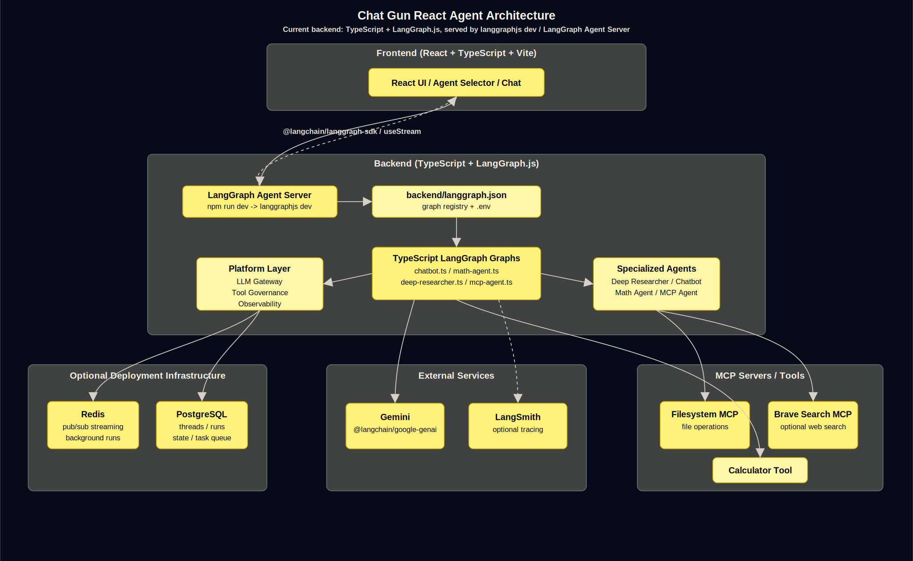

# Chat Gun React Agent

[](https://github.com/langchain-ai/langchainjs/blob/main/LICENSE)
[](https://langchain-ai.github.io/langgraphjs/)
[](https://github.com/Ylang-Labs/langgraph-react-agent-studio)

🤖 Chat Gun React Agent 是一個 fullstack AI agent studio，使用 React、TypeScript、LangGraph JS、Gemini，並可選擇整合 MCP tools。

💡 本專案僅做個人研究使用 (This project is for personal research use only)。

## Demo

<p align="center">
  
</p>

<p align="center">
  
</p>

<p align="center">
  
</p>

## 目前實際運行方式

此專案分成兩個本地開發服務：

- `backend`：LangGraph JS agent server，由 `npm run dev` 啟動，預設 API URL 是 `http://localhost:2024`。
- `frontend`：Vite React app，由 `npm run dev` 啟動，預設頁面 URL 是 `http://localhost:5173/app/`。

前端會從 `VITE_LANGGRAPH_API_URL` 讀取 LangGraph API URL。若未設定，依照目前 `frontend/src/App.tsx` 的實作會使用：

- 開發環境：`http://localhost:2024`
- production build：`http://localhost:8123`

## 可用 Agent

目前 `backend/langgraph.json` 註冊了以下 graph ID：

- `deep_researcher`
- `chatbot`
- `math_agent`
- `mcp_agent`

前端 agent selector 使用相同 ID。

## 前置需求

- Node.js 20+
- npm
- Gemini API Key：<https://ai.google.dev/>
- 選用：Tavily API Key，用於 `deep_researcher` 的真實網路搜尋
- 選用：Docker，用於 Docker Compose 啟動
- 選用：`make`，用於 Makefile shortcut

## 本地開發啟動

### 1. 安裝依賴

```bash
cd backend
npm install

cd ../frontend
npm install
```

### 2. 設定 backend 環境變數

從範例建立 `backend/.env`：

```bash
cd backend
cp .env.example .env
```

PowerShell：

```powershell
cd backend
Copy-Item .env.example .env
```

至少需要設定真實 Gemini key：

```env
GEMINI_API_KEY=your_gemini_api_key
DEFAULT_MODEL=gemini-2.5-flash
CHAT_MODEL=gemini-2.5-flash
MATH_MODEL=gemini-2.5-flash
MCP_AGENT_MODEL=gemini-2.5-flash
```

若需要 `deep_researcher` 真正查網路，請設定 Tavily key：

```env
TAVILY_API_KEY=your_tavily_api_key
```

`current_weather` 使用 Open-Meteo，不需要 API key。若需要自訂地名 alias，請用環境變數設定：

```env
WEATHER_LOCATION_ALIASES_JSON={"台北":{"query":"Taipei","country":"Taiwan"}}
```

`LANGSMITH_API_KEY`、`REDIS_URI`、`POSTGRES_URI` 對預設本地 `langgraphjs dev` 流程不是必填，除非你已經把這些服務接進 runtime。

### 3. 啟動 backend

Terminal 1：

```bash
cd backend
npm run dev -- --no-browser
```

PowerShell：

```powershell
cd <project-root>\backend
npm run dev -- --no-browser
```

實際 backend URL：

```text
http://localhost:2024
```

這是 `langgraphjs dev` 目前的預設 port。

### 4. 啟動 frontend

Terminal 2：

```bash
cd frontend
VITE_LANGGRAPH_API_URL=http://localhost:2024 npm run dev
```

PowerShell：

```powershell
cd <project-root>\frontend
$env:VITE_LANGGRAPH_API_URL="http://localhost:2024"
npm run dev
```

打開：

```text
http://localhost:5173/app/
```

明確設定 `VITE_LANGGRAPH_API_URL` 可以避免端口混淆。如果不設定，目前前端開發環境也會 fallback 到 `http://localhost:2024`。

## Makefile 指令

Makefile 目前對應到這些實際 script：

```bash
make dev-backend
make dev-frontend
make dev
```

等價指令：

```bash
cd backend && npm run dev
cd frontend && npm run dev
```

在 Windows / PowerShell 上，建議用兩個 terminal 分開啟動 backend 與 frontend；`make dev` 會同時啟動兩個長駐程序，排錯不如分開清楚。

## MCP 設定

MCP 是選用功能，目前預設只會額外擴充 `mcp_agent`。

依照目前 `backend/src/tools/registry.ts` 的實作，native tools 會隨 agent 啟動載入：`calculator_tool`、`web_search`、`web_fetch`、`current_weather`。MCP tools 只有在 agent 要求載入 MCP 且 `MCP_LOAD_ON_START=true` 時才會額外載入。

`deep_researcher` 預設不載入 MCP tools，避免 filesystem 類大量工具干擾 research graph 啟動與 tool planning。若要讓 `deep_researcher` 也使用 MCP，請同時設定 `DEEP_RESEARCHER_MCP_ENABLED=true` 與 `MCP_LOAD_ON_START=true`。

`backend/.env.example` 預設是：

```env
MCP_LOAD_ON_START=false
DEEP_RESEARCHER_MCP_ENABLED=false
```

如果你要在本地啟用 MCP tools，請在 `backend/.env` 改成：

```env
MCP_LOAD_ON_START=true
DEEP_RESEARCHER_MCP_ENABLED=false
MCP_FILESYSTEM_ENABLED=true
MCP_FILESYSTEM_PATH=<project-root>

MCP_BRAVE_SEARCH_ENABLED=false
BRAVE_API_KEY=
TAVILY_API_KEY=your_tavily_api_key
```

注意：

- Filesystem MCP 啟用時會透過 `npx -y @modelcontextprotocol/server-filesystem` 啟動。
- `MCP_FILESYSTEM_PATH` 請設定成本機存在且允許讀取的路徑。
- `TAVILY_API_KEY` 供 native `web_search` 使用。
- `BRAVE_API_KEY` 只供選用的 Brave MCP server 使用。
- 只有在 `BRAVE_API_KEY` 有效時才把 `MCP_BRAVE_SEARCH_ENABLED` 設成 `true`。
- 一般本地流程不需要全域安裝 MCP servers；filesystem server 已在 backend dependencies 中，Brave MCP server 會透過 `npx -y @modelcontextprotocol/server-brave-search` 啟動。

## Tool 能力說明

目前不是所有 agent 都有外部 tool 能力：

- `chatbot`：純 LLM 對話，沒有 tool calling。
- `math_agent`：使用本地 `calculator_tool`。
- `mcp_agent`：使用 `ToolNode` 與 `bindTools`，可載入 native tools 與 MCP tools。
- `deep_researcher`：使用明確的 research orchestration graph：`plan_research -> targeted_tools | search_web -> rank_sources -> fetch_sources -> extract_evidence -> verify_citations -> synthesize_answer`。預設使用 native tools。

`deep_researcher` 與 `mcp_agent` 會將 Gemini 回傳的 raw `functionCall` content block 正規化為 LangChain 標準 `tool_calls`，避免 frontend streaming 發生 `Unknown content type undefined`。

Native tools：

- `web_search`：呼叫 Tavily Search API，需要 `TAVILY_API_KEY`。
- `web_fetch`：抓取公開 HTTP/HTTPS URL，抽取 title、description 與可讀文字。
- `current_weather`：呼叫 Open-Meteo current weather API，不需要 API key；使用通用 geocoding、`country/region` 消歧，沒有內建城市白名單。
- `calculator_tool`：本地數學計算。

若需要查詢即時新聞、法規、產品規格等外部資料，請設定 `TAVILY_API_KEY`。如果需要公司內部系統、資料庫或專用 SaaS，建議新增對應 MCP server 或 native tool，並透過 `backend/src/tools/registry.ts` 納入 tool registry。

## 驗證指令

Backend typecheck：

```bash
cd backend
npm run build
```

Frontend production build：

```bash
cd frontend
npm run build
```

目前預期結果：兩個 build 都會通過。前端 build 可能出現 Vite chunk size warning，這不影響本地啟動。

## Docker Compose 啟動

Docker Compose 會建置 frontend 與 backend，並將 LangGraph API image 暴露在主機 port `8123`。

目前 `docker-compose.yml` 會傳入 `MCP_LOAD_ON_START`、`DEEP_RESEARCHER_MCP_ENABLED`、`MCP_FILESYSTEM_ENABLED`、`MCP_FILESYSTEM_PATH`、`MCP_BRAVE_SEARCH_ENABLED`、`BRAVE_API_KEY`、`TAVILY_API_KEY`。Docker Compose 模式下如需 MCP external tools，請設定 `MCP_LOAD_ON_START=true`；native tools 則會隨 agent 啟動載入。

注意：Docker Compose 模式下 `MCP_LOAD_ON_START=true` 預設只會影響 `mcp_agent`。`deep_researcher` 若要載入 MCP，還需要設定 `DEEP_RESEARCHER_MCP_ENABLED=true`。

PowerShell：

```powershell
cd <project-root>
$env:GEMINI_API_KEY="your_gemini_api_key"
$env:LANGSMITH_API_KEY=""
$env:DEEP_RESEARCHER_MCP_ENABLED="false"
$env:MCP_FILESYSTEM_ENABLED="true"
$env:MCP_FILESYSTEM_PATH="/app/workspace"
$env:MCP_BRAVE_SEARCH_ENABLED="false"
$env:TAVILY_API_KEY=""
$env:BRAVE_API_KEY=""
docker compose up --build
```

Bash：

```bash
GEMINI_API_KEY=your_gemini_api_key \
LANGSMITH_API_KEY= \
DEEP_RESEARCHER_MCP_ENABLED=false \
MCP_FILESYSTEM_ENABLED=true \
MCP_FILESYSTEM_PATH=/app/workspace \
MCP_BRAVE_SEARCH_ENABLED=false \
TAVILY_API_KEY= \
BRAVE_API_KEY= \
docker compose up --build
```

打開：

```text
http://localhost:8123/app/
```

Docker Compose 模式下 API base URL：

```text
http://localhost:8123
```

## 架構概覽

<p align="center">
  
</p>

目前 runtime layer：

- Frontend：React、TypeScript、Vite、Tailwind CSS、Radix UI。
- Backend：TypeScript LangGraph JS graphs，本地由 `langgraphjs dev` 服務。
- LLM provider：透過 `@langchain/google-genai` 使用 Gemini。
- Native tools：calculator、Tavily Search API、web fetch、Open-Meteo weather。
- Optional MCP tools：filesystem MCP 與 Brave Search MCP server，主要供 `mcp_agent` 使用。
- Docker Compose：LangGraph API image，加上 Redis 與 PostgreSQL containers。

## 常用端口對照

| 模式 | Frontend | Backend API | 指令 |
| --- | --- | --- | --- |
| 本地開發 | `http://localhost:5173/app/` | `http://localhost:2024` | 兩個子專案各自執行 `npm run dev` |
| Docker Compose | `http://localhost:8123/app/` | `http://localhost:8123` | `docker compose up --build` |

## 目前設定注意事項

- `frontend/vite.config.ts` 有一段 `/api` proxy 指向 `http://127.0.0.1:8000`，但目前主流程是 `useStream` 直接使用 `VITE_LANGGRAPH_API_URL` 或 fallback URL，沒有依賴這個 `/api` proxy。
- 本地開發請以 `http://localhost:2024` 作為 LangGraph API 的實際來源。
- Docker Compose 請以 `http://localhost:8123` 作為對外 API 來源。

## License

本專案採用 Apache License 2.0。詳細內容請見 [LICENSE](LICENSE)。
