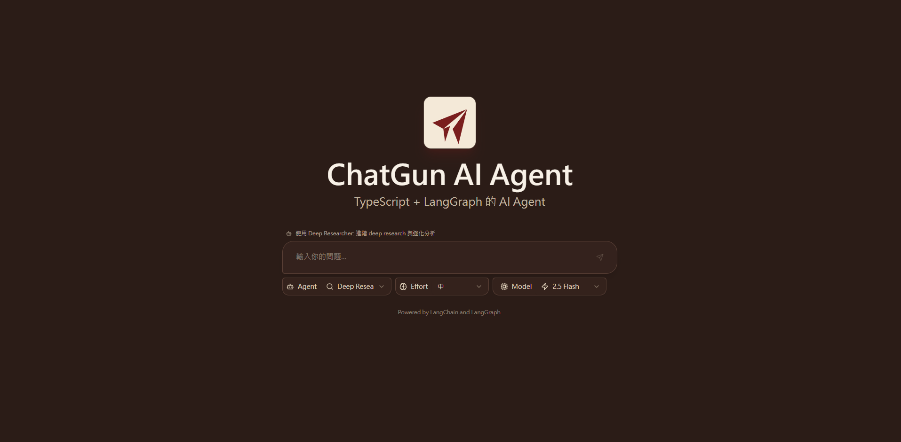
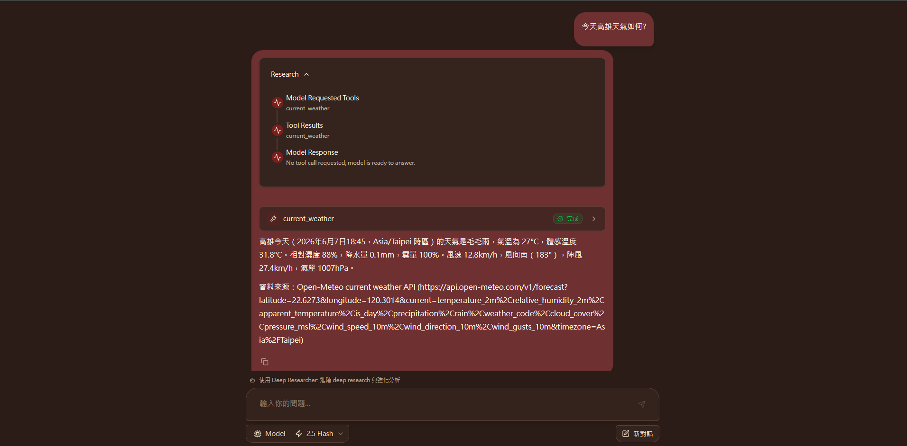

# Chat Gun React Agent

[](https://github.com/langchain-ai/langchainjs/blob/main/LICENSE)
[](https://langchain-ai.github.io/langgraphjs/)
[](https://github.com/Ylang-Labs/langgraph-react-agent-studio)

🤖 Chat Gun React Agent 是一個以 React、TypeScript、LangGraph JS、Gemini、原生工具與選用 MCP tools 組成的 Fullstack AI agent studio。

💡 本專案僅做個人研究使用 (This project is for personal research use only)。

## Demo

<p align="center">
  
</p>

<p align="center">
  
</p>

<p align="center">
  
</p>

## 目前架構

實際程式碼目前分成三個主要 package：

| 目錄 | 職責 | 本機預設 port |
| --- | --- | --- |
| `frontend/` | Vite React 前端聊天介面 | `5173` |
| `bff/` | BFF / API Gateway，代理前端到 LangGraph 的流量 | `8787` |
| `backend/` | LangGraph JS agent runtime、LLM gateway、tools | `2024` |

本機開發流量：

```text
Browser
  -> http://localhost:5173/app/
  -> /api/langgraph/*
  -> Vite proxy
  -> BFF http://127.0.0.1:8787
  -> LangGraph API http://localhost:2024
```

`frontend/src/App.tsx` 會預設產生絕對 API URL：

```text
http://localhost:5173/api/langgraph
```

`frontend/vite.config.ts` 會把 `/api/*` proxy 到：

```text
http://127.0.0.1:8787
```

## Agent

LangGraph graph ID 定義在 `backend/langgraph.json`：

- `deep_researcher`
- `chatbot`
- `math_agent`
- `mcp_agent`

前端預設 agent 由 `frontend/src/types/agents.ts` 設定，目前是：

```text
chatbot
```

## 需求

- Node.js 20+
- npm
- Gemini API Key
- 選用：Tavily API Key，供 `deep_researcher` 的 `web_search` 使用
- 選用：Docker / Docker Compose
- 選用：make

## 安裝

三個 package 需要分別安裝依賴：

```bash
cd backend
npm install

cd ../bff
npm install

cd ../frontend
npm install
```

PowerShell：

```powershell
cd chat-gun-react-agent\backend
npm install

cd ..\bff
npm install

cd ..\frontend
npm install
```

## 環境變數

### Backend

建立 `backend/.env`：

```bash
cd backend
cp .env.example .env
```

PowerShell：

```powershell
cd backend
Copy-Item .env.example .env
```

Gemini 相關設定：

```env
GEMINI_API_KEY=your_gemini_api_key
DEFAULT_MODEL=gemini-2.5-flash
CHAT_MODEL=gemini-2.5-flash
MATH_MODEL=gemini-2.5-flash
MCP_AGENT_MODEL=gemini-2.5-flash
```

`deep_researcher` 使用原生 `web_search` 時需要：

```env
TAVILY_API_KEY=your_tavily_api_key
```

如果 backend 所在網路無法直連 Gemini API，可以在啟動 backend 前設定 proxy：

```env
HTTPS_PROXY=http://127.0.0.1:7890
HTTP_PROXY=http://127.0.0.1:7890
NO_PROXY=localhost,127.0.0.1
```

`backend/src/platform/network.ts` 會讀取 `HTTPS_PROXY` / `HTTP_PROXY`，並透過 `undici` 設定 Node fetch 的全域 proxy dispatcher。

### BFF

建立 `bff/.env`：

```bash
cd bff
cp .env.example .env
```

預設 BFF 設定：

```env
BFF_PORT=8787
BFF_LANGGRAPH_API_URL=http://localhost:2024
BFF_FRONTEND_DIST=../frontend/dist
BFF_ALLOWED_ORIGINS=http://localhost:5173,http://127.0.0.1:5173
BFF_REQUIRE_AUTH=false
BFF_API_KEYS=
BFF_MAX_BODY_BYTES=1048576
BFF_UPSTREAM_TIMEOUT_MS=120000
BFF_RATE_LIMIT_WINDOW_MS=60000
BFF_RATE_LIMIT_MAX_REQUESTS=120
```

BFF 目前提供：

- `/api/health`：BFF process health
- `/api/ready`：檢查 LangGraph upstream `/ok`
- `/api/langgraph/*`：代理到 LangGraph API
- CORS allowlist
- optional API key auth
- request body size limit
- upstream timeout
- in-memory rate limit
- JSON audit log

## 本機開發

請開三個 terminal。

Terminal 1：啟動 LangGraph backend

```bash
cd backend
npm run dev
```

Backend 預設 URL：

```text
http://localhost:2024
```

Terminal 2：啟動 BFF

```bash
cd bff
npm run dev
```

BFF 預設 URL：

```text
http://127.0.0.1:8787
```

確認 BFF 能連到 LangGraph：

```powershell
Invoke-RestMethod http://127.0.0.1:8787/api/ready
```

預期會看到：

```json
{
  "status": "ready"
}
```

Terminal 3：啟動前端

```bash
cd frontend
npm run dev
```

開啟：

```text
http://localhost:5173/app/
```

## Makefile

根目錄 `Makefile` 目前提供：

```bash
make dev-backend
make dev-bff
make dev-frontend
make dev
```

在 Windows / PowerShell 環境下，建議三個服務分別用三個 terminal 啟動，除錯會比較清楚。

## Build / Typecheck

Backend：

```bash
cd backend
npm run build
```

BFF：

```bash
cd bff
npm run build
```

Frontend：

```bash
cd frontend
npm run build
```

Frontend build 可能出現 Vite chunk size warning；只要 process exit code 是 0，build 仍是成功。

## Docker Compose

`docker-compose.yml` 目前有：

- `langgraph-redis`
- `langgraph-postgres`
- `langgraph-api`
- `bff`

`langgraph-api` 不對 host 暴露 port，只在 Compose network 內提供 `8000`。

對外暴露的是 BFF：

```text
http://localhost:8123
```

啟動：

```bash
docker compose up --build
```

PowerShell 範例：

```powershell
cd <project-root>
$env:GEMINI_API_KEY="your_gemini_api_key"
$env:LANGSMITH_API_KEY=""
$env:MCP_LOAD_ON_START="false"
$env:DEEP_RESEARCHER_MCP_ENABLED="false"
$env:MCP_FILESYSTEM_ENABLED="true"
$env:MCP_FILESYSTEM_PATH="/app/workspace"
$env:MCP_BRAVE_SEARCH_ENABLED="false"
$env:TAVILY_API_KEY=""
$env:BRAVE_API_KEY=""
docker compose up --build
```

開啟：

```text
http://localhost:8123/app/
```

Docker Compose 流量：

```text
Browser
  -> http://localhost:8123/app/
  -> BFF container
  -> http://langgraph-api:8000
```

如果 Docker 內的 backend 也需要 proxy，目前 `docker-compose.yml` 尚未把 `HTTPS_PROXY` / `HTTP_PROXY` 傳給 `langgraph-api`，需要自行加到 `langgraph-api.environment`。

## Tools

原生 tools 由 `backend/src/tools/registry.ts` 載入。

目前包含：

- `calculator_tool`
- `web_search`
- `web_fetch`
- `current_weather`

注意：

- `web_search` 使用 Tavily API，需要 `TAVILY_API_KEY`。
- `current_weather` 使用 Open-Meteo，不需要 API key。
- `web_fetch` 目前只做基本 HTTP/HTTPS 檢查，不是完整 SSRF sandbox。
- MCP tools 是選用功能，透過 backend env flags 控制。

### Weather location resolution

`current_weather` uses Open-Meteo geocoding plus Open-Meteo current weather. It does not require an API key.

The weather flow accepts the location text from the planner, keeps the original user-provided text in `requestedLocation.raw`, normalizes the query with trim, Unicode NFKC, whitespace cleanup, and control-character removal, then resolves the place through the geocoding provider. It returns a structured `WeatherToolResult` with:

- `status: "success"` for resolved current weather.
- `status: "needs_clarification"` when a location has multiple plausible candidates.
- `status: "not_found"` when no provider candidate can be used.
- `status: "error"` with stable codes such as `weather_geocoding_provider_error`, `weather_forecast_provider_error`, `weather_timeout`, and `weather_cancelled`.

The resolver is provider-driven. The project must not use a fixed city allowlist or manual city mapping such as mapping a few hard-coded Chinese names to English names as the primary resolution mechanism. Small closed lists are only acceptable for domain constants such as weather code labels, country-code display names, or wind direction labels.

Weather-related backend settings:

```env
WEATHER_STRUCTURED_RESULT_ENABLED=true
WEATHER_LOCATION_MAX_CHARS=160
WEATHER_GEOCODING_MAX_QUERIES=6
WEATHER_GEOCODING_MAX_CANDIDATES=10
WEATHER_GEOCODING_MIN_SCORE=35
WEATHER_GEOCODING_AMBIGUITY_DELTA=8
WEATHER_GEOCODING_TIMEOUT_MS=5000
WEATHER_FORECAST_TIMEOUT_MS=8000
```

Tests use mock geocoding and weather data by default and do not require Open-Meteo network access:

```bash
cd backend
npm run test

cd ../frontend
npm run test
```

Limitations:

- The tool reports the latest current observation, not a full-day forecast.
- Ambiguous locations require the user to provide country, region, or another distinguishing hint.
- Provider errors and timeouts are reported as service failures, not as missing locations.
- Cancellation should terminate the weather result with `weather_cancelled` and must not leave the frontend in a running state.

## MCP

相關 backend env：

```env
MCP_LOAD_ON_START=false
DEEP_RESEARCHER_MCP_ENABLED=false
MCP_FILESYSTEM_ENABLED=true
MCP_FILESYSTEM_PATH=your_filesystem_path
MCP_BRAVE_SEARCH_ENABLED=false
BRAVE_API_KEY=your_brave_api_key_here
```

說明：

- `mcp_agent` 會依設定載入 MCP tools。
- `deep_researcher` 只有在 `DEEP_RESEARCHER_MCP_ENABLED=true` 時才會包含 MCP tools。
- 生產環境建議把 MCP execution 拆到獨立 Tool Service / container，並加上權限、沙箱、egress policy、timeout 與 audit。

## 疑難排解

### 前端出現 `Invalid URL`

LangGraph SDK 需要 absolute API URL。目前前端預設會用：

```text
window.location.origin + /api/langgraph
```

如果自行設定 `VITE_LANGGRAPH_API_URL`，必須是完整 URL，例如：

```env
VITE_LANGGRAPH_API_URL=http://localhost:5173/api/langgraph
```

### 前端 `/api/langgraph/threads` 回 502

先檢查 BFF readiness：

```powershell
Invoke-RestMethod http://127.0.0.1:8787/api/ready
```

再檢查 backend：

```powershell
Invoke-RestMethod http://localhost:2024/ok
```

### `Research synthesis failed ... Gemini ... fetch failed`

這表示 frontend、BFF、LangGraph 已經通了，但 backend 連不到 Gemini。

檢查：

```powershell
Test-NetConnection generativelanguage.googleapis.com -Port 443
```

如果你的網路需要 proxy，請在啟動 `backend` 前設定 `HTTPS_PROXY` / `HTTP_PROXY`。

## 更多文件

BFF 細節請看：

```text
docs/bff.md
```

## License

Apache License 2.0。詳見 [LICENSE](./LICENSE)。
