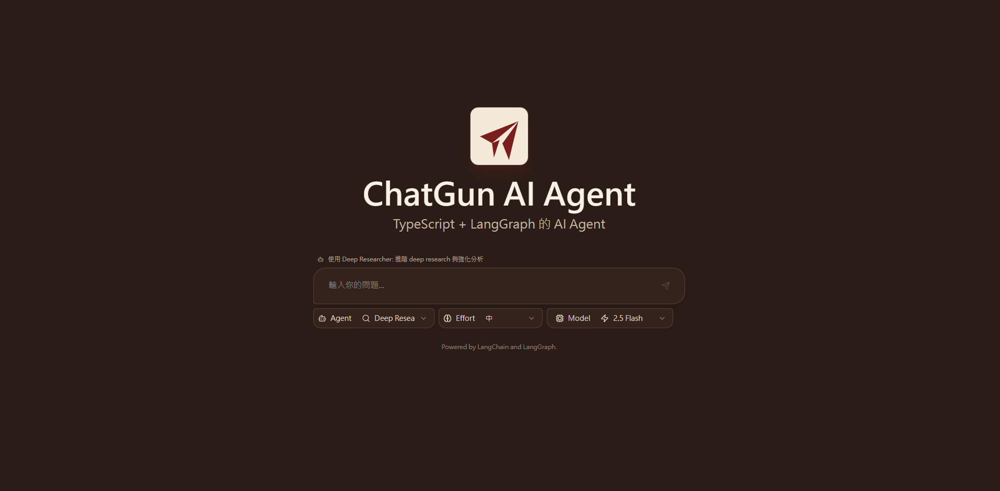
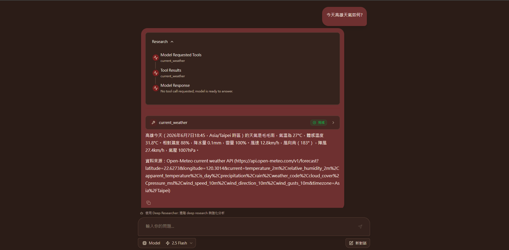
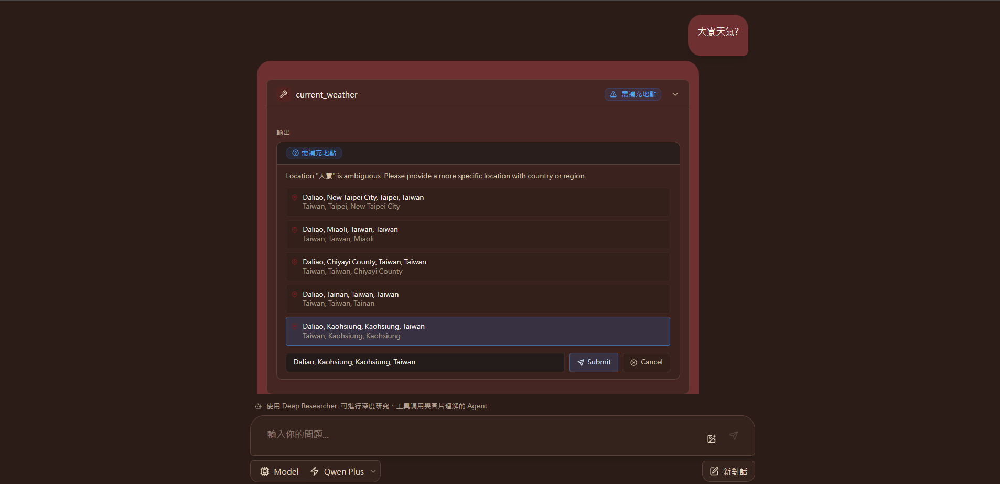

# Chat Gun React Agent

[](./LICENSE)
[](https://langchain-ai.github.io/langgraphjs/)
[](https://github.com/Ylang-Labs/langgraph-react-agent-studio)

Chat Gun React Agent 是一套以 React、TypeScript 與 LangGraph JS 建構的全端 Agent Chat 應用。它支援多 Agent 對話、串流回覆、Tool Calling、圖片輸入與 Human-in-the-Loop，並透過 BFF 統一處理瀏覽器與 LangGraph Runtime 之間的 API 流量。

## Demo

<p align="center">
  
</p>

<p align="center">
  
</p>

<p align="center">
  
</p>

<p align="center">
  
</p>

## 功能

- Deep Researcher、Chat Assistant、Math Solver 與 MCP Agent。
- 串流回答、執行活動顯示、取消與錯誤處理。
- 天氣地點不明確時，可向使用者提問並接續原本的執行。
- PNG、JPEG、WebP 圖片輸入與圖片理解。
- 計算、網路搜尋、網頁擷取、目前天氣與天氣預報工具。
- 可選用 Filesystem 與 Brave Search MCP Server。
- Qwen、OpenAI-compatible 與 CCR-compatible 模型端點。
- API key 認證、CORS、請求大小限制、逾時、取消傳遞與 rate limiting。
- Metrics、OpenTelemetry，以及選用的 Opik tracing 與 evaluation。

## 架構

```text
Browser
  -> frontend: Vite + React 19 + TypeScript
  -> bff: Node.js + TypeScript
  -> backend: LangGraph JS + LangChain
  -> Model Provider / Native Tools / MCP Tools
```

| 目錄 | 用途 | 本機預設 port |
| --- | --- | ---: |
| `frontend/` | Chat UI、串流狀態、工具結果與圖片輸入 | `5173` |
| `bff/` | API gateway、驗證、代理、逾時與限流 | `8787` |
| `backend/` | LangGraph agents、模型整合、Tools 與 MCP | `2024` |

本機開發時，Frontend 會把 `/api/*` 代理至 BFF；LangGraph 請求經由 `/api/langgraph/*` 轉送到 Backend。模型、Tool 與 MCP credential 只保留在 Server 端。

```text
http://localhost:5173/app/
  -> http://127.0.0.1:8787/api/langgraph/*
  -> http://localhost:2024
```

## Agents

| Graph ID | 名稱 | 用途 |
| --- | --- | --- |
| `deep_researcher` | Deep Researcher | 深度研究、來源整理、工具調用、天氣查詢與圖片理解 |
| `chatbot` | Chat Assistant | 一般對話 |
| `math_agent` | Math Solver | 數學問題與運算 |
| `mcp_agent` | MCP Agent | 使用已啟用的 native／MCP tools |

Frontend 提供 `qwen-plus`、`qwen-max` 與 `qwen-turbo`，預設選用 `qwen-plus`。Backend 可針對不同 Agent 指定模型。

## 系統需求

- Node.js 22
- npm
- Qwen API key，或可用的 OpenAI-compatible／CCR-compatible endpoint
- Tavily API key（使用網路搜尋時需要）
- Docker 與 Docker Compose（選用）

## 安裝

```bash
git clone https://github.com/HsienW/chat-gun-react-agent.git
cd chat-gun-react-agent

cd backend && npm ci
cd ../bff && npm ci
cd ../frontend && npm ci
cd ..
```

PowerShell：

```powershell
git clone https://github.com/HsienW/chat-gun-react-agent.git
Set-Location chat-gun-react-agent

Set-Location backend
npm ci
Set-Location ..\bff
npm ci
Set-Location ..\frontend
npm ci
Set-Location ..
```

## 設定

### Backend

從範例建立本機設定：

```bash
cp backend/.env.example backend/.env
```

PowerShell：

```powershell
Copy-Item backend/.env.example backend/.env
```

使用 Qwen 時，至少填入：

```env
LLM_PROVIDER=qwen
QWEN_API_KEY=your_qwen_api_key
```

Deep Researcher 的網路搜尋使用 Tavily：

```env
TAVILY_API_KEY=your_tavily_api_key
```

也可以連接其他模型端點：

```env
# OpenAI-compatible
LLM_PROVIDER=openai-compatible
OPENAI_COMPATIBLE_BASE_URL=https://your-endpoint.example/v1
OPENAI_COMPATIBLE_API_KEY=your_api_key
OPENAI_COMPATIBLE_MODEL=your_model

# CCR-compatible
LLM_PROVIDER=ccr
CCR_BASE_URL=http://127.0.0.1:3456/v1
CCR_API_KEY=your_api_key
CCR_MODEL=your_model
```

其他模型、圖片、天氣、Tool 與 MCP 設定請參閱 [`backend/.env.example`](./backend/.env.example)。不要將 API key 或其他 credential 提交到版本控制。

### BFF

```bash
cp bff/.env.example bff/.env
```

PowerShell：

```powershell
Copy-Item bff/.env.example bff/.env
```

| 環境變數 | 用途 |
| --- | --- |
| `BFF_LANGGRAPH_API_URL` | LangGraph API URL |
| `BFF_ALLOWED_ORIGINS` | 允許存取 BFF 的瀏覽器 origins |
| `BFF_REQUIRE_AUTH` | 是否要求 API key 或 Bearer token |
| `BFF_API_KEYS` | 允許使用的 API keys |
| `BFF_MAX_BODY_BYTES` | Request body 上限 |
| `BFF_UPSTREAM_TIMEOUT_MS` | Upstream request timeout |
| `BFF_RATE_LIMIT_REDIS_URI` | Redis rate limiter；留空時使用 in-memory limiter |

完整選項請參閱 [`bff/.env.example`](./bff/.env.example)。公開部署時，請啟用認證並限制 `BFF_ALLOWED_ORIGINS`。

### Frontend

本機開發不需要建立 `frontend/.env`。Frontend 預設使用同源 `/api/langgraph`；分開部署時可指定 BFF URL：

```env
VITE_LANGGRAPH_API_URL=https://api.example.com/api/langgraph
```

圖片輸入限制請參閱 [`frontend/.env.example`](./frontend/.env.example)。`VITE_*` 會出現在瀏覽器 bundle，不能用來保存 secret。

## 本機開發

分別啟動 Backend、BFF 與 Frontend。

```bash
# Terminal 1
cd backend
npm run dev
```

```bash
# Terminal 2
cd bff
npm run dev
```

```bash
# Terminal 3
cd frontend
npm run dev
```

開啟 <http://localhost:5173/app/>。

可使用 BFF 的健康檢查確認服務狀態：

```bash
curl http://127.0.0.1:8787/api/health
curl http://127.0.0.1:8787/api/ready
```

PowerShell：

```powershell
Invoke-RestMethod http://127.0.0.1:8787/api/health
Invoke-RestMethod http://127.0.0.1:8787/api/ready
```

`/api/ready` 會檢查 BFF 是否能連上 LangGraph Backend。

## Tools

| Tool | 用途 | 必要設定 |
| --- | --- | --- |
| `calculator_tool` | 算術運算 | 無 |
| `web_search` | Tavily 網路搜尋 | `TAVILY_API_KEY` |
| `web_fetch` | HTTP／HTTPS 網頁擷取 | 無 |
| `current_weather` | Open-Meteo 目前天氣 | 無 |
| `weather_forecast` | Open-Meteo 天氣預報 | 無 |

可以使用 `TOOL_ALLOWLIST`、`TOOL_DENYLIST`、`TOOL_TIMEOUT_MS` 與個別 Tool 設定限制可用範圍。`web_fetch` 預設只允許 port `80`、`443`，並拒絕不安全的 private network address。

## MCP

MCP tools 預設不會在啟動時載入。啟用 Filesystem MCP：

```env
MCP_LOAD_ON_START=true
MCP_FILESYSTEM_ENABLED=true
MCP_FILESYSTEM_PATH=/absolute/path/to/workspace
MCP_FILESYSTEM_ALLOWED_ROOTS=/absolute/path/to/workspace
```

讓 Deep Researcher 使用 MCP tools：

```env
DEEP_RESEARCHER_MCP_ENABLED=true
```

啟用 Brave Search MCP：

```env
MCP_BRAVE_SEARCH_ENABLED=true
BRAVE_API_KEY=your_brave_api_key
```

`MCP_FILESYSTEM_PATH` 必須位於 `MCP_FILESYSTEM_ALLOWED_ROOTS` 內。多個 root 在 Windows 使用 `;` 分隔，在 Linux／macOS 使用 `:`。

## Observability

BFF 提供 metrics endpoint：

```bash
curl http://127.0.0.1:8787/api/metrics
```

OpenTelemetry 預設關閉。連接 OTLP collector：

```env
OTEL_ENABLED=true
OTEL_SERVICE_NAME=chat-gun-react-agent
OTEL_EXPORTER_OTLP_ENDPOINT=http://localhost:4318
OTEL_EXPORTER_OTLP_PROTOCOL=http
OTEL_SAMPLE_RATE=1
```

Opik 可用於開發期間的 Agent tracing 與 Weather evaluation。它預設關閉；啟用 hosted tracing 時應使用非正式環境資料，並保持 redaction 開啟。

```env
OPIK_ENABLED=true
OPIK_API_KEY=your_opik_api_key
OPIK_WORKSPACE=your_workspace
OPIK_REDACT_ENABLED=true
```

執行 evaluation：

```bash
cd backend
npm run eval:opik
```

## Docker Compose

Docker Compose 會啟動 PostgreSQL、Redis、LangGraph API 與 BFF，並由 BFF 提供建置後的 Frontend。

在專案根目錄建立 `.env`：

```env
QWEN_API_KEY=your_qwen_api_key
TAVILY_API_KEY=your_tavily_api_key
```

啟動服務：

```bash
docker compose up --build
```

開啟 <http://localhost:8123/app/>。

Compose 預設使用 Qwen。改用其他 provider 或啟用額外 Backend 功能時，請把對應環境變數加入 `docker-compose.yml` 的 `langgraph-api.environment`。

## 測試

Backend：

```bash
cd backend
npm run lint
npm run test
npm run build
```

BFF：

```bash
cd bff
npm run test
npm run build
```

Frontend：

```bash
cd frontend
npm run lint
npm run test
npm run build
```

## 疑難排解

### Frontend 出現 `Invalid URL`

`VITE_LANGGRAPH_API_URL` 必須是完整 URL。若 Frontend 與 BFF 使用同一個 origin，移除這個設定即可。

```env
VITE_LANGGRAPH_API_URL=http://localhost:5173/api/langgraph
```

### `/api/langgraph/*` 回傳 502

先確認 BFF 與 Backend 狀態：

```powershell
Invoke-RestMethod http://127.0.0.1:8787/api/ready
Invoke-RestMethod http://localhost:2024/ok
```

再檢查 `BFF_LANGGRAPH_API_URL` 是否指向正在執行的 LangGraph API。

### `Research synthesis failed ... fetch failed`

確認模型或 Tool provider 的 API key、base URL 與網路連線。使用 Qwen／Alibaba Cloud Bailian 時，可以先測試：

```powershell
Test-NetConnection dashscope.aliyuncs.com -Port 443
```

需要 proxy 時，在 `backend/.env` 設定 `HTTPS_PROXY`、`HTTP_PROXY` 與 `NO_PROXY`，然後重新啟動 Backend。

## 文件

- [BFF API 與安全設定](./docs/bff.md)
- [Backend query workflow](./docs/architecture.md)
- [TypeScript／LangGraph architecture](./docs/typescript-langgraph-architecture.md)
- [Tool security isolation](./docs/tool-security-isolation.md)

## License

Apache License 2.0。詳見 [LICENSE](./LICENSE)。
